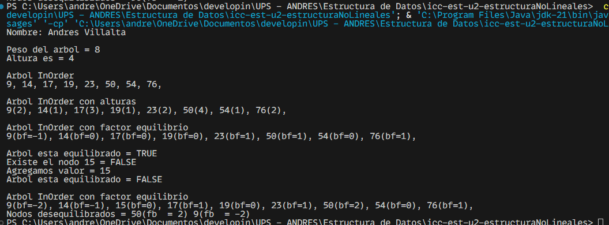

# Práctica de Arboles y sus Atributos

## 📌 Información General

- **Título:** Práctica Nodos
- **Asignatura:** Estructura de Datos
- **Carrera:** Computación
- **Estudiante(s):** Andres Villalta
- **Fecha:** 19 de junio del 2025
- **Profesor:** Ing. Pablo Torres

---

## 🛠️ Descripción

Este proyecto implementa como hacer uso de los nodos y calcular sus propiedades como la altura, factor de equilibrio y el peso del arbol en general.

Posterior, se imprimira de forma ordenada todos los datos ordenados a manera de listado.

---

## 🚀 Ejecución

Para ejecutar el proyecto:

1. Compila el código:
    ```bash
    javac App.java
    ```
2. Ejecuta la aplicación:
    ```bash
    java App
    ```


## 📷 Resultado Esperados




